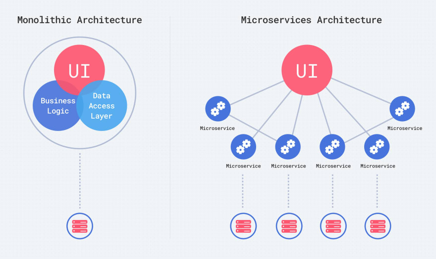

layout: true

.signature[@algogrit]

---

class: center, middle

# GCP Advanced

Gaurav Agarwal

---

# Agenda

- Cloud & Serverless is AWESOME!

---

class: center, middle

## Who is this class for?

---

- Application Developers

- SRE & devops engineers

---
class: center, middle

## What are we going to learn?

---
class: center, middle

*Outline*

---

class: center, middle


Software Engineer & Product Developer

Director of Engineering & Founder @ https://codermana.com

ex-Tarka Labs, ex-BrowserStack, ex-ThoughtWorks

---

class: center, middle

Co-organizer of Chennai Go meetup

Volunteer at Golang India - Remote study group

---

class: center, middle

*What we wanted*


---

class: center, middle

*What we got*


---

## As a instructor

- I promise to

  - make this class as interactive as possible

  - use as many resources as available to keep you engaged

  - ensure everyone's questions are addressed

---

## What I need from you

- Be vocal

  - Let me know if there any audio/video issues ASAP

  - Feel free to interrupt me and ask me questions

- Be punctual

- Give feedback

- Work on the exercises

- Be *on mute* unless you are speaking

---
class: center, middle

## Class Progression

---
class: center, middle


---
class: center, middle

Here you are trying to *learn* something, while here your *brain* is doing you a favor by making sure the learning doesn't stick!

---

### Some tips

- Slow down => stop & think
  - listen for the questions and answer

- Do the exercises
  - not add-ons; not optional

- There are no dumb questions!

- Drink water. Lots of it!

---

### Some tips (continued)

- Take notes
  - Try: *Repetitive Spaced Out Learning*

- Talk about it out loud

- Listen to your brain

- *Experiment!*

---
class: center, middle

### 📚 Content ` > ` 🕒 Time

---
class: center, middle

## Show of hands

*Yay's - in Chat*

---
class: center, middle

## Application Development Process

---
class: center, middle

### Monolithic architecture

---
class: center, middle

A monolithic application is built as a single unit.

---

Typical enterprise applications are built in three parts:

- A database — consisting of many tables usually in a relational database management system

- A client-side user interface — consisting of HTML pages and/or JavaScript running in a browser)

- A server-side application — which will handle HTTP requests, execute domain-specific logic, retrieve and update data from the database, and populate the HTML views to be sent to the browser.

---
class: center, middle

*single logical executable*


---
class: center, middle

Monolith apps allow you to set your deployment once and then simply adjust it based on ongoing changes.

---

#### Benefits of Monolith

- Simple to develop — At the beginning of a project it is much easier to go with Monolithic Architecture.

- Simple to test. For example, you can implement end-to-end testing by simply launching the application and testing the UI with Selenium.

- Simple to deploy. You have to copy the packaged application to a server.

- Simple to scale horizontally by running multiple copies behind a load balancer.

---
class: center, middle


---
class: center, middle

*Makes it simple to deploy*

---

#### Drawbacks of Monolith

- Tight coupling between components

- Maintenance — If Application is too large and complex to understand entirely, it is challenging to make changes fast and correctly.

- The size of the application can slow down the start-up time.

- You must redeploy the entire application on each update.

- Monolithic applications can also be challenging to scale when different modules have conflicting resource requirements.

- Reliability — Bug in any module (e.g. memory leak) can potentially bring down the entire process. Moreover, since all instances of the application are identical, that bug impact the availability of the entire application

- Regardless of how easy the initial stages may seem, Monolithic applications have difficulty to adopting new and advance technologies.

---
class: center, middle

Since changes in languages or frameworks affect an entire application, it requires efforts to thoroughly work with the app details, hence it is costly considering both time and efforts.

---
class: center, middle

*Harder to build and maintain parts of application by multiple teams*

---
class: center, middle

### Building an application in a microservice architecture

---
class: center, middle

*Microservices are better suited to scalability*

---
class: center, middle



---

#### Benefits of Microservices

- Enables the continuous delivery and deployment of large, complex applications.

- Better testability — services are smaller and faster to test.

- Better deployability — services can be deployed independently.

- It enables you to organize the development effort around multiple teams. Each team is responsible for one or more single service. Each team can develop, deploy and scale their services independently of all of the other teams.

- Each microservice is relatively small

.content-credits[https://medium.com/koderlabs/introduction-to-monolithic-architecture-and-microservices-architecture-b211a5955c63]

---

- Comfortable for a developer to understand

- The IDE is faster making developers more productive

- The application starts faster, which makes developers more productive, and speeds up deployments

- Improved fault isolation. For example, if there is a memory leak in one service then only that service is affected. The other services continue to handle requests. In comparison, one misbehaving component of a monolithic architecture can bring down the entire system.

- Eliminates any long-term commitment to a technology stack. When developing a new service you can pick a new technology stack. Similarly, when making major changes to an existing service you can rewrite it using a new technology stack.

.content-credits[https://medium.com/koderlabs/introduction-to-monolithic-architecture-and-microservices-architecture-b211a5955c63]

---
class: center, middle

#### Modes of communication


---
class: center, middle

Let's decompose the monolith Ecomm application into microservices...

---
class: center, middle


---
class: center, middle

*But...*

---

- How do I manage the dependencies?

- How do I deploy it?

- How do I manage the configuration?

- How do I manage scaling/monitoring/logging?

- Service discovery?

---
class: center, middle

#### Dependency Hell - [Problem](https://github.com/AgarwalConsulting/DockerTraining/blob/master/Problem.md)

---
class: center, middle


.image-credits[https://blog.newrelic.com/technology/app-centric-docker-monitoring-webinar/attachment/dependency-hell/]

---
class: center, middle

##### Solutions?

---
class: center, middle

Let's start with VM?

---
class: center, middle

*Virtual Machines* aka Hardware Virtualization

---
class: center, middle


.image-credits[https://www.nakivo.com/blog/physical-servers-vs-virtual-machines-key-differences-similarities/]

---
class: center, middle


---
class: center, middle

*Leads to resource wastage*

---
class: center, middle

How about Docker?

---
class: center, middle

## Docker

---
class: center, middle

### VM vs Containers


.image-credits[https://www.weave.works/blog/a-practical-guide-to-choosing-between-docker-containers-and-vms]

---
class: center, middle

### Hypervisor vs Containers


.image-credits[https://www.docker.com/blog/containers-replacing-virtual-machines/]

---
class: center, middle

### Docker: under the hood

---
class: center, middle


---

class: center, middle

[OCI Runtime Specification](https://github.com/opencontainers/runtime-spec)

The Open Container Initiative develops specifications for standards on Operating System process and application containers.

.content-credits[https://github.com/opencontainers/runtime-spec/blob/master/spec.md]

---
class: center, middle

`docker run hello-world`

---

### Primer


.image-credits[https://docs.docker.com/engine/docker-overview/]

---
class: center, middle

### Containers

---
class: center, middle


---

- Using `docker run`, to start a container

- Using `docker ps`, to view status of containers

- Using `docker stop`, to stop a container

- Using `docker rm`, to remove a stopped container

---
class: center, middle

*Exercise*: Run a linux container, create a file inside it and stop it

---
class: center, middle

Containers are *ephemeral*

---
class: center, middle

### Images

---

#### Key concepts

- Image is the definition of what a **container** is created from.

- Images are **immutable**. If you make changes, a new image must be built.

- Images are made of **layers**.

- Images are **inherited** from **base images** and can be many levels deep.

- `docker images`

.content-credits[https://www.vergeops.com/]

---
class: center, middle

#### Dockerfile

Or `dockerfile`, `my-dockerfile`, ...

---

- Use `Dockerfile`

  - *Infrastructure as Code*

  - All images are based on other images as their parent.

  - You must choose a parent, or `FROM` image.

  - `scratch` is the base empty image supplied by Docker.

  - Base images include all settings, files, what command runs at startup, etc.

- Create an image using

  - `docker build`

---

Here is the format of the `Dockerfile`:

```Dockerfile
# Comment
INSTRUCTION arguments
```

---

Eg. [`hello-world`'s `Dockerfile`](https://hub.docker.com/_/hello-world)

```bash
cat Dockerfile
```

```dockerfile
FROM scratch
COPY hello /
CMD ["/hello"]
```

---

#### Other Commands

There are just a handful of simple `Instructions`:

```bash
FROM # which image this inherits from
LABEL # custom information
WORKDIR # Change to a directory until changed again.
  # Works like cd
USER # Change to a user
RUN # Run a Linux command in a new layer.
  # The command is dependent on which shell is in the image.
EXPOSE # Tells what ports this container will listen on.
  # Does not actually publish a port, but is rather like documentation.
ADD # copy files into the container
COPY # copy files into the container.
  # Similar to ADD
ENTRYPOINT # The command to be run when container is started.
  # This is inherited from a base image.
CMD # provides defaults to be run after the ENTRYPOINT.
  # Also inherited from the base image.
```

[More...](https://docs.docker.com/engine/reference/builder/)

---

#### Layers

- Images are made of **layers**.

- Each instruction in a `Dockerfile` adds a layer. (*True* for older Docker installations)

- When pushing/pulling an image to a repository (more to come), only the **changed layers** are pushed to save bandwidth.

- When building an image, Docker steps through the instructions in your Dockerfile, executing each in the order specified.

---
class: center, middle

Only the instructions *RUN, COPY, ADD* create layers.

.content-credits[https://docs.docker.com/develop/develop-images/dockerfile_best-practices/]

---
class: center, middle


.image-credits[https://www.vergeops.com/]

---

#### Image Tags

- You can uniquely identify an image using a tag name

- `docker build -t <image-name>:<tag-name> .`

- `latest` is the default tag name

---
class: center, middle

*Optional Exercise*: Create a `hello-world` image, similar to [`hello-haskell`](https://github.com/AgarwalConsulting/DockerTraining/tree/master/examples/0-hello-world/hello-haskell)

---
class: center, middle


.image-credits[https://ekababisong.org/docker-kubeflow-for-poets/]

---
class: center, middle

### Registry

---

- Many options: Docker Hub, AWS ECR, GCP Container Registry, ...

- Default: https://hub.docker.com/

- Private repository...

---

#### Pulling from a repository

`docker pull hello-world`

---

#### Pushing to a repository

`docker push <image-name>:<tag-name>`

---
class: center, middle

*Optional Exercise*: [Push the `hello-world` image to hub](https://github.com/AgarwalConsulting/DockerTraining/blob/master/challenges/pushing-to-remote-repo.md), ask a participant to run it on their system

---
class: center, middle

Let's look at the `Dockerfile` of the ecommerce microservice...

---

Docker can also manage:

- Network between containers

- Volumes and storage for containers

- Life of the container: `restart_policy`

---
class: center, middle

#### Alternatives to Docker

---
class: center, middle

*LXC (Linux Containers) is an operating-system-level virtualization method for running multiple isolated Linux systems (containers) on a control host using a **single Linux kernel**.*


.content-credits[https://linuxcontainers.org/]

---

- [Podman](https://podman.io/)

- [CRI-O](https://cri-o.io/)

- [Katacontainers](https://katacontainers.io/)

- [gVisor](https://gvisor.dev/)

- ...

---
class: center, middle

#### [12 Factor](https://12-factor-apps.slides.algogrit.com/) Apps

---
class: center, middle

### Orchestrating your containers (Managing multiple containers)

---
class: center, middle

#### Docker Compose

---
class: center, middle

How about scaling it to multiple machines...

---
class: center, middle

### Thought Experiment: [Search Engine](https://github.com/AgarwalConsulting/Kubernetes-Training/blob/master/Problem.md)

---

- cluster of machines
- From ~10 to millions of microservices
- Manage/Share resources efficiently
  - Memory
  - CPU
  - Storage
  - GPU
  - ...
- Fault Tolerance
  - Healing & resiliency
- Isolation
- Networking
  - Service Discovery
- Managing Deployment
- Auto-Scaling
- ...

---
class: center, middle

## Kubernetes

---
class: center, middle

### Kubernetes Architecture


---
class: center, middle

### Control Plane Components

Control plane components can be run on any machine in the cluster. However, for simplicity, set up scripts typically start all control plane components on the same machine, and do not run user containers on this machine.

---
class: center, middle

### Worker Plane components - Nodes

Node components run on every node, maintaining running pods and providing the Kubernetes runtime environment.

---
class: center, middle

### K8s - CLI Tools

---

#### `kubeadm`

- The `kubeadm` tool helps you [bootstrap](https://kubernetes.io/docs/reference/setup-tools/kubeadm/kubeadm/) a minimum viable Kubernetes cluster that conforms to best practices.

  *In fact, you can use `kubeadm` to set up a cluster that will pass the [Kubernetes Conformance tests](https://kubernetes.io/blog/2017/10/software-conformance-certification/).*

- A simple way for you to try out Kubernetes, possibly for the first time.

- A way for existing users to automate setting up a cluster and test their application.

- A building block in other ecosystem and/or installer tools with a larger scope.

.content-credits[https://kubernetes.io/docs/setup/production-environment/tools/kubeadm/create-cluster-kubeadm/]

---

#### `kubectl`

- The `kubectl` command line tool lets you control Kubernetes clusters.

- For configuration, kubectl looks for a file named `config` in the `$HOME/.kube` directory.

- You can specify other kubeconfig files by setting the `KUBECONFIG` environment variable or by setting the `--kubeconfig` flag.

- Makes it reasonably easy to work with multiple clusters using: `kubectl config` & `contexts`

.content-credits[https://kubernetes.io/docs/reference/kubectl/overview/]

---

#### [`kind`](https://kind.sigs.k8s.io/docs/user/quick-start/)

- command line tool which allows for simulating a multi node k8s cluster

---
class: center, middle

### K8s Basics (Cluster Computing)

---
class: center, middle

#### Nodes

`Node = machine`

---

- Kubernetes runs your workload by placing containers into Pods to run on Nodes.
- A node may be a virtual or physical machine, depending on the cluster.
- Each node contains the services necessary to run Pods, managed by the control plane.

##### Useful commands

- `kubectl get nodes`
- `-o wide` for more information
- `kubectl describe`

---
class: center, middle

### Running our first container on a Kubernetes cluster

---
class: center, middle

`kubectl run --image=agarwalconsulting/fib-gen fibonacci`

---
class: center, middle

### Workloads

---
class: center, middle

#### Pods

---

- Pods are the smallest deployable units of computing that can be created and managed in Kubernetes.

- A Pod *(as in a pod of whales or pea pod)* is a group of one or more containers *(such as Docker containers)*, with shared storage/network, and a specification for how to run the containers.

- A Pod always runs on a Node.

- Every pod gets a unique IP.

- If multiple containers per pod, pods can communicate with localhost.

##### Useful `kubectl` commands

- `kubectl get pods -o`
- `kubectl describe pods`
- `kubectl logs -f <name>`
- `kubectl exec`
- `kubectl delete pod <name>`

---
class: center, middle

#### Relation between Pods and containers


---
class: center, middle

#### Relation between Nodes and Pods


---
class: center, middle

Kubernetes supports *declarative* management of objects

---
class: center, middle

Take a look at another e-commerce application: [RVStore](https://github.com/AgarwalConsulting/rvstore/blob/master/services.md)

---
class: center, middle

Kubernetes chose simplicity and skipped the dynamic port-allocation deal. It just assumes that all containers can communicate with each other without Network Address Translation (NAT), that all containers can communicate with each node (and vice-versa), and that the IP that a container sees for itself is the same that the other containers see for it.

.content-credits[https://blog.octo.com/en/how-does-it-work-docker-part-2-swarm-networking/]

---

In Kubernetes, there are 3 entities which have IPs assigned:

- Pods
  - Containers in a Pod share the same IP

- Service

- Nodes

---
class: center, middle

### Networking, Load Balancing & Discovery: [`service`](https://kubernetes.io/docs/concepts/services-networking/service/)

---

#### Overview

- An abstract way to expose an application running on a set of Pods as a network service.

- The service resource also lets you expose an application running in Pods to be reachable from outside your cluster.

- Containers within a Pod use networking to communicate via loopback.

---
class: center, middle

#### [Ingress](https://kubernetes.io/docs/concepts/services-networking/ingress)

*An API object that manages external access to the services in a cluster, typically HTTP.*

---
class: center, middle

Ingress exposes HTTP and HTTPS routes from outside the cluster to services within the cluster. Traffic routing is controlled by rules defined on the Ingress resource.

---
class: center, middle

## Intro to Distributed Systems

---
class: center, middle

A distributed system is a system whose components are located on different networked computers, which communicate and coordinate their actions by passing messages to one another from any system.

---

- A computer program that runs within a distributed system is called a distributed program (and distributed programming is the process of writing such programs). There are many different types of implementations for the message passing mechanism, including pure *HTTP*, *RPC-like connectors* and *message queues*.

- Distributed computing also refers to the use of distributed systems to solve computational problems. In distributed computing, a problem is divided into many tasks, each of which is solved by one or more computers, which communicate with each other via message passing.

---

### Design issues of distributed system

- *Heterogeneity*: Heterogeneity is applied to the network, computer hardware, operating system and implementation of different developers. A key component of the heterogeneous distributed system client-server environment is middleware. Middleware is a set of services that enables application and end-user to interacts with each other across a heterogeneous distributed system.

- *Openness*: The openness of the distributed system is determined primarily by the degree to which new resource-sharing services can be made available to the users. Open systems are characterized by the fact that their key interfaces are published. It is based on a uniform communication mechanism and published interface for access to shared resources. It can be constructed from heterogeneous hardware and software.

- *Scalability*: Scalability of the system should remain efficient even with a significant increase in the number of users and resources connected.

---

- *Security*: Security of information system has three components Confidentially, integrity and availability. Encryption protects shared resources, keeps sensitive information secrets when transmitted.

- *Failure Handling*: When some faults occur in hardware and the software program, it may produce incorrect results or they may stop before they have completed the intended computation so corrective measures should to implemented to handle this case.

Failure handling is difficult in distributed systems because the failure is partial i.e., some components fail while others continue to function.

---

- *Concurrency*: There is a possibility that several clients will attempt to access a shared resource at the same time. Multiple users make requests on the same resources, i.e read, write, and update. Each resource must be safe in a concurrent environment. Any object that represents a shared resource a distributed system must ensure that it operates correctly in a concurrent environment.

- *Transparency*: Transparency ensures that the distributes system should be perceived as a single entity by the users or the application programmers rather than the collection of autonomous systems, which is cooperating. The user should be unaware of where the services are located and the transferring from a local machine to a remote one should be transparent.

---
class: center, middle

### CAP Theorem

---

In theoretical computer science, the CAP theorem, also named Brewer's theorem after computer scientist Eric Brewer, states that it is impossible for a distributed data store to simultaneously provide more than two out of the following three guarantees:

- *Consistency*: Every read receives the most recent write or an error

- *Availability*: Every request receives a (non-error) response, without the guarantee that it contains the most recent write

- *Partition tolerance*: The system continues to operate despite an arbitrary number of messages being dropped (or delayed) by the network between nodes

---

When a network partition failure happens should we decide to

- Cancel the operation and thus decrease the availability but ensure consistency

- Proceed with the operation and thus provide availability but risk inconsistency

---
class: center, middle


.image-credits[https://dzone.com/articles/understanding-the-cap-theorem]

---
class: center, middle

The CAP theorem implies that in the presence of a network partition, one has to choose between consistency and availability.

*Note that consistency as defined in the CAP theorem is quite different from the consistency guaranteed in ACID database transactions.*

---
class: center, middle

### Distributed consensus

---
class: center, middle

Distributed consensus is to make all processes in a system to agree on a single value after one or more processes propose this value.

---

- The industrial application of distributed consensus is to build the multi-replicated state machine model to achieve high availability and strong consistency.

- Distributed consensus allows multiple machines to share the same state and run the same deterministic state machine, so that the entire machine can continue working normally when a few machines fail.

---

Common consensus algorithms

- [Raft](https://raft.github.io/)

- [Paxos](https://www.cs.rutgers.edu/~pxk/417/notes/paxos.html)

---
class: center, middle

Let's take the ecommerce app to the cloud...

---
class: center, middle

... but before that...

---
class: center, middle

### Understanding Resource Hierarchy in GCP

.content-credits[https://cloud.google.com/resource-manager/docs/cloud-platform-resource-hierarchy#organizations]

---

Purpose of the Google Cloud resource hierarchy is two-fold:

- Provide a hierarchy of ownership, which binds the lifecycle of a resource to its immediate parent in the hierarchy.

- Provide attach points and inheritance for access control and organization policies.

---

4 main components

- Organizations

- Folders

- Projects

- Resources

---
class: center, middle


---
class: center, middle

### Permission & Roles

---

- Permissions

  Permissions determine what operations are allowed on a resource

- Roles

  A role is a collection of permissions. You cannot grant a permission to the user directly.

---

There are several kinds of roles in IAM:

- Basic roles: Roles historically available in the Google Cloud Console. These roles are `Owner`, `Editor`, and `Viewer`.

- Predefined roles: Roles that give finer-grained access control than the basic roles. For example, the predefined role Pub/Sub Publisher (roles/pubsub.publisher) provides access to only publish messages to a Pub/Sub topic.

- Custom roles: Roles that you create to tailor permissions to the needs of your organization when predefined roles don't meet your needs.

---
class: center, middle


---
class: center, middle

### Members & IAM Policy

---

Members can be of the following types:

- Google Account

- Service account

- Google group

- Google Workspace domain

- Cloud Identity domain

- All authenticated users

- All users

---
class: center, middle

Each member type is identified with a prefix, such as a Google Account (`user:`), service account (`serviceAccount:`), Google group (`group:`), or a Google Workspace or Cloud Identity domain (`domain:`).

---
class: center, middle

*With IAM, every API method across all Google Cloud services is checked to ensure that the account making the API request has the appropriate permission to use the resource.*

---

- An IAM policy is represented by the IAM Policy object.

- An IAM Policy object consists of a list of *role bindings*.

- A *role binding* binds a list of `members` to a `role`.

---
class: center, middle


---
class: center, middle


---
class: center, middle


---
class: center, middle

...coming back to deployment!

---
class: center, middle

## GCP Offerings

---
class: center, middle

### Compute Engine


---
class: center, middle

*Secure and customizable compute service that lets you create and run virtual machines on Google’s infrastructure.*

---
class: center, middle

*VMs are the underlying hardware you use for developing apps and running your workloads. All VMs are categorized by machine family.*

---

Machine configurations are defined by the following terms:

- Machine family: A curated set of processor and hardware configurations optimized for specific workloads. During the VM creation process, you choose your preferred machine family and configure your VM.

- Series: Within the console, machine families are further classified by series generation. Newer VMs are listed under second generation, and older VMs are listed under first generation.

- Machine type: Every machine family has predefined machine shapes that have a specific vCPU to memory ratio that fits a variety of workload needs. If a predefined machine type does not meet your needs, you can create a custom machine for any general-purpose VM.

---
class: center, middle


.content-credits[https://cloud.google.com/compute/docs/machine-types]

---
class: center, middle

*Compute Engine instances can run the public images for Linux and Windows Server that Google provides as well as private custom images that you can create or import from your existing systems.*

---
class: center, middle

[Compute Images](https://console.cloud.google.com/compute/images)

---
class: center, middle

*Simple enough for Monolith.* How about micro-services?

---

Many options:

- Docker containers

- Multiple VM instances

---
class: center, middle

#### VPC & Subnets

.content-credits[https://cloud.google.com/vpc/docs/overview]

---
class: center, middle

Virtual Private Cloud (VPC) provides networking functionality to *Compute Engine virtual machine* (VM) instances, *Google Kubernetes Engine* (GKE) clusters, and the App Engine flexible environment.

---
class: center, middle

A *VPC network* is a **global** resource that consists of a list of **regional** virtual subnetworks (*subnets*) in data centers, all connected by a global wide area network.

---
class: center, middle


---

#### CIDR Refresher

- 10.0.0.0/8

- 192.168.0.0/16

- 172.16.0.0/12

- 169.254.0.0/16

What do these values mean?

---

##### Private IPv4 ranges

- **10.0.0.0/8**

- **192.168.0.0/16**

- **172.16.0.0/12**

---

A VPC network provides the following:

- Provides connectivity for your Compute Engine virtual machine (VM) instances, including Google Kubernetes Engine (GKE) clusters, App Engine flexible environment instances, and other Google Cloud products built on Compute Engine VMs.

- Offers built-in Internal TCP/UDP Load Balancing and proxy systems for Internal HTTP(S) Load Balancing.

- Connects to on-premises networks using Cloud VPN tunnels and Cloud Interconnect attachments.

- Distributes traffic from Google Cloud external load balancers to backends.

---
class: center, middle

VPC networks are logically isolated from each other in Google Cloud.

---
class: center, middle

Too much configuration!

---
class: center, middle

### App Engine


---
class: center, middle

An App Engine app is made up of a single application resource that consists of one or more services.

---
class: center, middle


---

#### Drawbacks of App Engine

- Locked into Google App Engine

- Developers have read-only access to the filesystem on App Engine.

- App Engine can only execute code called from an HTTP request (except for scheduled background tasks).

- Users may upload arbitrary Python modules, but only if they are pure-Python; C and Pyrex modules are not supported.

- App Engine limits the maximum rows returned from an entity get to 1000 rows per Datastore call. (Update - App Engine now supports cursors for accessing larger queries)

- Java applications may only use a subset (The JRE Class White List) of the classes from the JRE standard edition.

- Java applications cannot create new threads.

---
class: center, middle

#### App Engine Limitations


---
class: center, middle

### GKE


---
class: center, middle

## Going Serverless...

---

- No infra management

- Fully managed security

- Pay only for usage

---
class: center, middle

### [Functions Framework](https://cloud.google.com/functions/docs/functions-framework)

---
class: center, middle

#### Cloud Run


---
class: center, middle

#### Cloud Functions


---
class: center, middle

Code
https://github.com/AgarwalConsulting/GCP-Training

Slides
https://gcp-advanced.slides.algogrit.com
